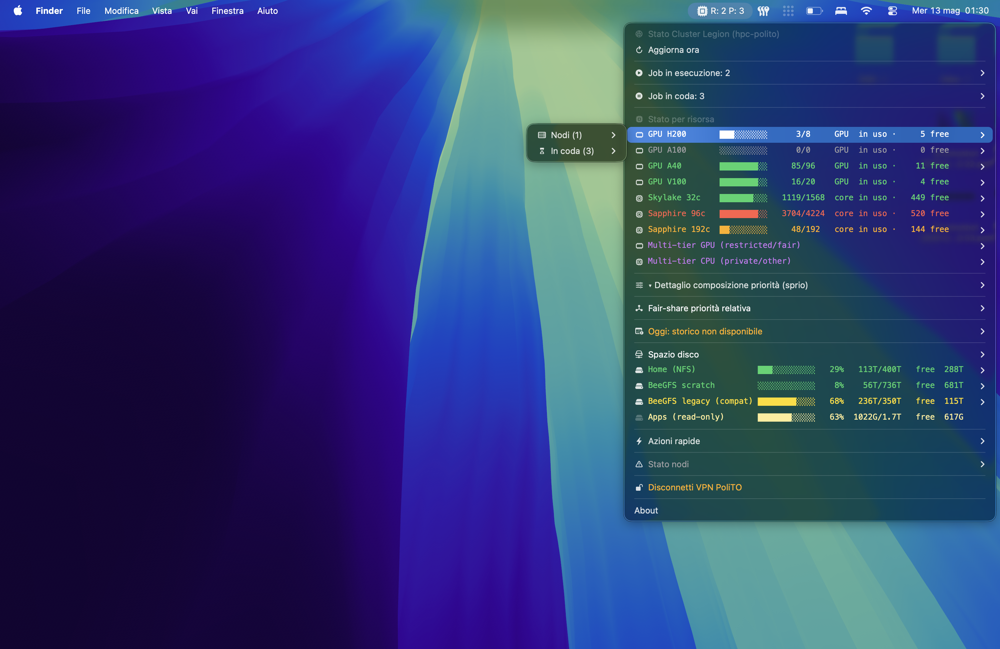
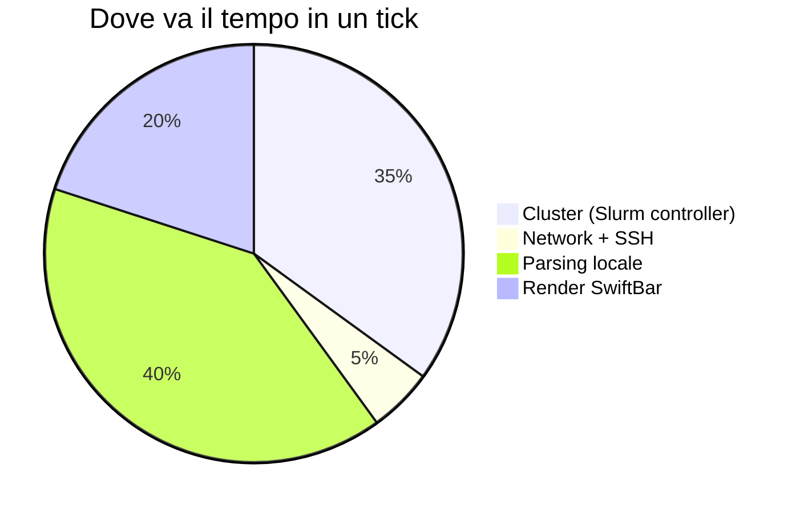

<div align="center">


# polito-hpc-swiftbar

**Dashboard SwiftBar per il cluster HPC Legion del Politecnico di Torino + manager VPN.**

[](LICENSE)
[](https://github.com/swiftbar/SwiftBar)
[](https://www.zsh.org/)
[](https://github.com/Sipioteo/polito-hpc-swiftbar/actions)

<br>



</div>

<br>

Due plugin SwiftBar che uso ogni giorno per lavorare sul cluster Slurm Legion del PoliTO.

`PoliTO_VPN.5s.sh` apre e chiude la VPN del Politecnico via `openfortivpn` con SAML login. `HPC_Monitor.10s.sh` mostra lo stato live del cluster: cosa è libero per famiglia hardware, i miei job, le code per risorsa, fair-share normalizzato, log dei job, spazio disco, manutenzione.

I due si nascondono a vicenda: VPN giù vedi VPN, VPN su sparisce e compare HPC. Quando schiacci connect/disconnect il refresh di SwiftBar è forzato a mano, niente attesa dei tick.

## Install rapido

```bash
git clone https://github.com/Sipioteo/polito-hpc-swiftbar.git ~/Developer/polito-hpc-swiftbar
cd ~/Developer/polito-hpc-swiftbar
./install.sh
```

`install.sh` fa, in ordine: brew se serve, `openfortivpn` + `tmux` + SwiftBar (cask), una entry sudoers ristretta che ti chiede UNA password, symlink dei due script nella plugin folder di SwiftBar, configurazione di `PluginDirectory`. Lo puoi rilanciare quante volte vuoi, salta quello che è già a posto.

## Install a mano

Se preferisci capire cosa stai facendo:

```bash
brew install openfortivpn tmux
brew install --cask swiftbar
```

Poi sudoers. Il plugin VPN deve poter chiamare `openfortivpn` e `pkill` come root senza password, sennò ti blocca un prompt ad ogni connect. `sudo visudo -f /etc/sudoers.d/polito-hpc-swiftbar` e dentro:

```
nome.utente ALL=(root) NOPASSWD: /opt/homebrew/bin/openfortivpn vpn.polito.it:443 --saml-login
nome.utente ALL=(root) NOPASSWD: /usr/bin/pkill -x openfortivpn
nome.utente ALL=(root) NOPASSWD: /usr/bin/pkill -x pppd
nome.utente ALL=(root) NOPASSWD: /usr/bin/pkill -9 -x openfortivpn
nome.utente ALL=(root) NOPASSWD: /usr/bin/pkill -9 -x pppd
```

Non mettere `NOPASSWD: ALL`. Significa che qualunque cosa giri sulla tua macchina può escalare a root senza chiederti niente. Le righe sopra sono limitate ai comandi specifici che servono.

SSH al cluster, in `~/.ssh/config`:

```
Host hpc-polito
    HostName hpc.polito.it
    User nome.cognome
    IdentityFile ~/.ssh/id_ed25519
    ServerAliveInterval 60
```

Test: `ssh hpc-polito whoami`. Se risponde col tuo username sei a posto.

Plugin nella cartella di SwiftBar:

```bash
PDIR="$HOME/Library/Application Support/SwiftBar/Plugins"
mkdir -p "$PDIR"
ln -sf "$PWD/HPC_Monitor.10s.sh" "$PDIR/"
ln -sf "$PWD/PoliTO_VPN.5s.sh"   "$PDIR/"
```

SwiftBar > Refresh All e li vedi.

## Variabili configurabili

Tutto editabile dall'UI di SwiftBar (Plugin → Edit), niente da toccare nel codice:

| Plugin | Variabile | Default | Note |
|---|---|---|---|
| HPC_Monitor | `VAR_HOST` | `hpc-polito` | Alias SSH definito in `~/.ssh/config` |
| HPC_Monitor | `VAR_SSH_TIMEOUT` | `3` | Secondi |
| HPC_Monitor | `VAR_VPN_PROCESS` | `openfortivpn` | Nome processo VPN da pgrep |
| HPC_Monitor | `VAR_HOME_QUOTA_GB` | `1536` | Limite home in GB. Su Legion è 1.5 TB, gli admin non lo espongono |
| PoliTO_VPN | `VAR_VPN_HOST` | `vpn.polito.it:443` | Gateway VPN |
| PoliTO_VPN | `VAR_TMUX_SESSION` | `polito-vpn` | Nome sessione tmux |
| PoliTO_VPN | `VAR_OFV_PATH` | `/opt/homebrew/bin/openfortivpn` | Path eseguibile |
| PoliTO_VPN | `VAR_TMUX_PATH` | `/opt/homebrew/bin/tmux` | Path eseguibile |
| PoliTO_VPN | `VAR_LOG_FILE` | `/tmp/openfortivpn.log` | Log openfortivpn |

Se cambi `VAR_VPN_HOST` devi rifare il sudoers col nuovo host (il match è esatto sulla command line). Rilancia `install.sh`.

## Cosa vedi nella dashboard HPC

In ordine, dall'alto:

I tuoi job in esecuzione e in coda. Per i running puoi aprire `tail -f` su stdout/stderr in terminale, fare `less +G`, scaricarti il log in `/tmp` con scp.

"Stato per risorsa" che riorganizza tutto per famiglia hardware: per ogni tipo di GPU/CPU vedi quanti device sono in uso, chi sta girando su ognuno, e la coda pending specifica per quel tier. Le partizioni multi-tier (`serics_gpu`, `fair_gpu`, `smartdata_gpu`, etc.) finiscono in due bucket separati per non duplicare le righe.

Fair-share calcolata in modo utile. Slurm su cluster grandi sputa valori che variano per millesimi tra una partizione e l'altra, completamente illeggibili. Qui vedi un punteggio 0-100 normalizzato sul tuo profilo: 100 dove sei più favorito, 0 dove sei più penalizzato. Più informativo del numero crudo.

Spazio disco: capacità per filesystem (Home NFS, BeeGFS scratch, BeeGFS legacy) con i tuoi path personali su ciascuno. Le quote per utente non sono esposte dal cluster (su Legion almeno, `quota` non risponde e `beegfs-ctl` non c'è installato). Se vuoi sapere quanto stai occupando c'è un pulsante "du -sh in terminale" che parte on-demand.

In fondo, manutenzione: reservations attive o imminenti, nodi DOWN/DRAIN. Sta in fondo perché c'è sempre qualche nodo giù su un cluster grande, non vale come allarme prioritario.

Tutto quello che gira lato cluster è sub-secondo. Solo `squeue`, `sinfo`, `scontrol`, `df`, `stat`. Niente scan ricorsivi, niente cose che ti tengono il cluster aperto per minuti.

## Sviluppo

I sorgenti stanno qui, SwiftBar legge i plugin via symlink dalla sua plugin folder. Salvi una modifica, al prossimo tick (5s o 10s) la vedi.

Lint e check sintassi:

```bash
zsh -n HPC_Monitor.10s.sh PoliTO_VPN.5s.sh install.sh
shellcheck --shell=bash HPC_Monitor.10s.sh PoliTO_VPN.5s.sh install.sh   # se installato
```

CI gira shellcheck e gitleaks su ogni push, vedi `.github/workflows/`.

## Cosa fa, e cosa non fa, per stare leggero

Il refresh gira in background ogni 10 secondi. Niente blocca la barra menu, niente apre finestre.

Lato cluster, ogni aggiornamento è una manciata di query read-only al controller Slurm (`squeue`, `sinfo`, `sshare`, `df`, `scontrol show node`). Tutte letture in-memory: stessa roba che fai tu se apri il terminale e digiti `squeue` per controllare lo stato. Nessuna scansione del filesystem, nessuna shell aperta sui compute nodes, niente che possa rallentare il lavoro di chi sta calcolando davvero.

Lato Mac, parsing dell'output e rendering del menu. Pochi MB di RAM, sotto un secondo di CPU.



### Per l'admin

Il plugin mantiene **una sola connessione SSH al login node** per sessione del Mac (multiplexing via `ControlMaster=auto`), non ne apre una nuova ad ogni refresh. Questo significa che dopo il primo login l'overhead di `sshd` per le successive query è praticamente zero.

Tutto il resto sono comandi nativi Slurm che leggono dalla shared memory del controller. Per il login node è equivalente al carico di un utente che tiene un terminale aperto e ricontrolla `squeue` ogni tanto.

### Vuoi pesare ancora meno

Cambia il refresh nel filename: `HPC_Monitor.30s.sh` aggiorna ogni 30 secondi, `HPC_Monitor.1m.sh` ogni minuto. Il plugin funziona uguale, fa solo meno controlli.

## Disinstallazione

```bash
sudo rm /etc/sudoers.d/polito-hpc-swiftbar
rm "$HOME/Library/Application Support/SwiftBar/Plugins/HPC_Monitor.10s.sh"
rm "$HOME/Library/Application Support/SwiftBar/Plugins/PoliTO_VPN.5s.sh"
```

E se vuoi togliere anche le dipendenze: `brew uninstall openfortivpn tmux` + `brew uninstall --cask swiftbar`.

## Licenza

GPLv3, vedi [`LICENSE`](LICENSE). Tradotto: usalo come vuoi, modificalo, redistribuiscilo. Se distribuisci una versione modificata anche tu devi pubblicare il sorgente con la stessa licenza. Niente fork chiusi.
